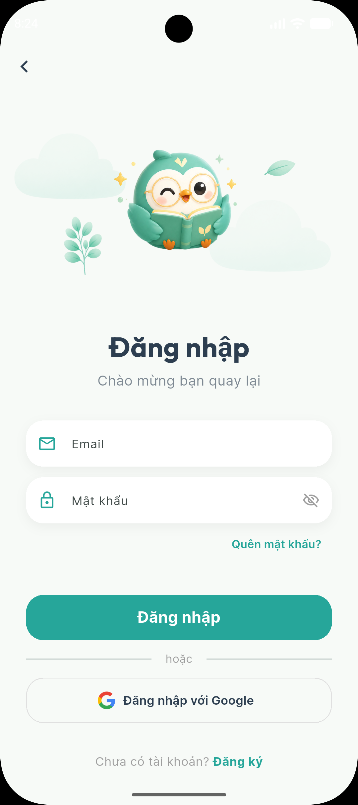
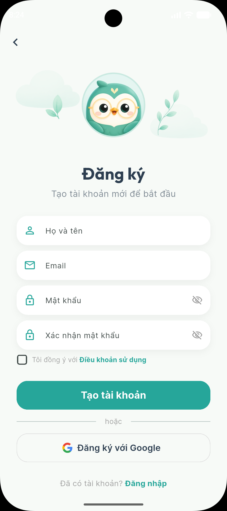
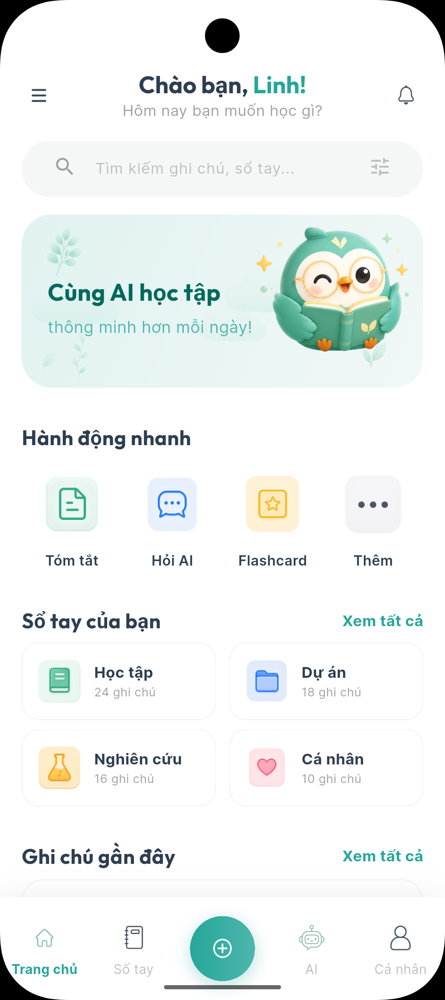
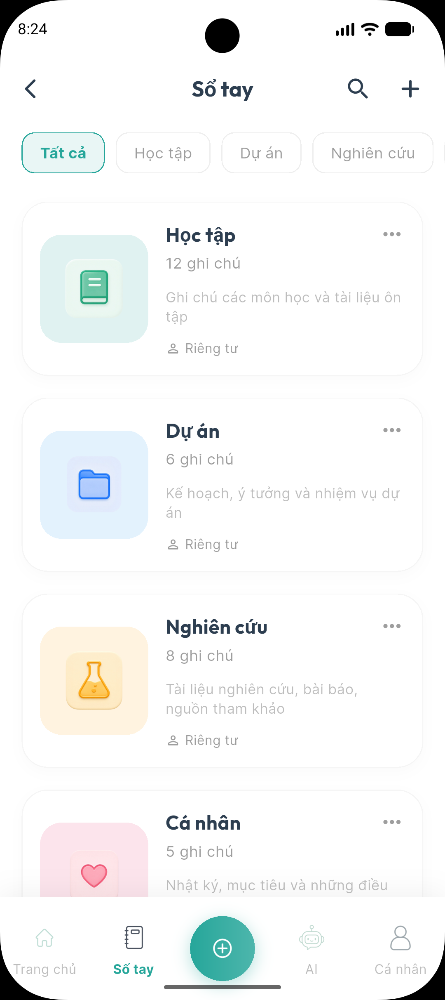
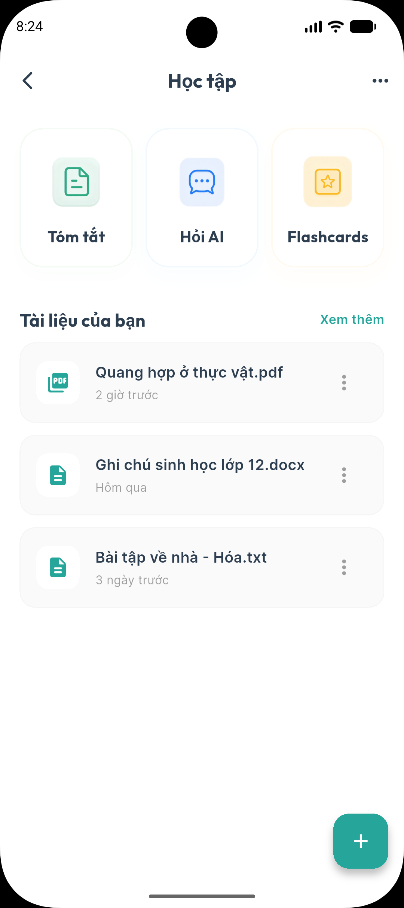
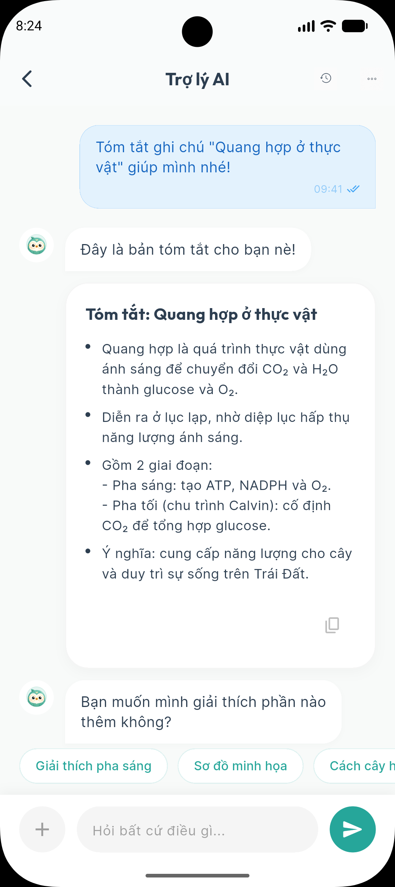
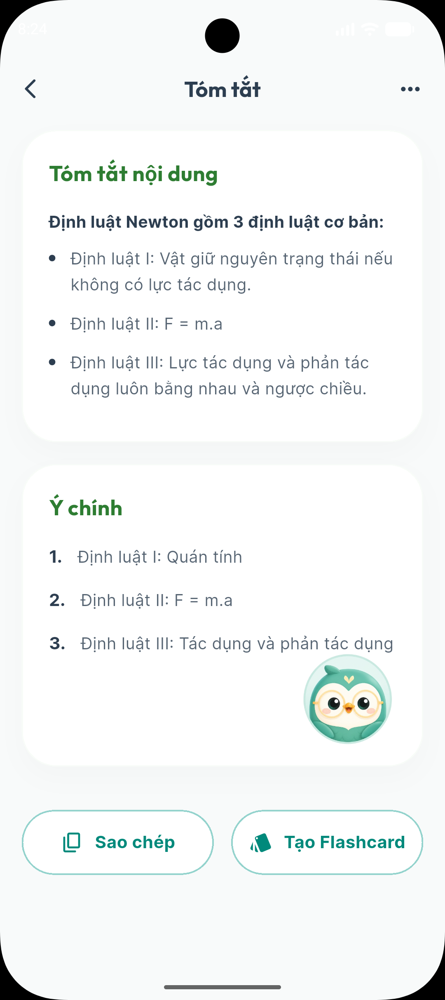
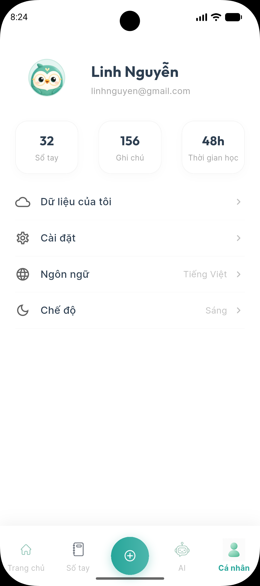

<div align="center">
<h1>
  <br>
  DOCUMIND
</h1>

### Deep Learning Final Project
**IBM Docling • BARTpho & ViT5 • PhoBERT & XLM-RoBERTa • Sentence Transformers**

---

[](https://flutter.dev)
[](https://fastapi.tiangolo.com)
[](https://www.python.org)
[](LICENSE)
[](#)
[](#)

<br/>

[](#)
[](https://www.linkedin.com/in/tandoanminh/)
[](#)
[](#)

<br/>

> *DocuMind is an AI-powered personal notebook assistant designed to help students and researchers manage and summarize their documents efficiently using state-of-the-art Deep Learning models.*

<br/>

[**Get Started**](#development-setup) · [**AI Stack**](#ai--deep-learning-stack) · [**Features**](#product-demo) · [**Docs**](#documentation)
</div>

<div align="center">
  🌍 <b><a href="./README_VN.md">Vietnamese Version</a></b>
</div>

---

## Product Demo

<table align="center">
  <tr>
    <td align="center"><br/><b>Onboarding</b></td>
    <td align="center"><br/><b>Login</b></td>
    <td align="center"><br/><b>Register</b></td>
  </tr>
  <tr>
    <td align="center"><br/><b>Home Screen</b></td>
    <td align="center"><br/><b>Notebook List</b></td>
    <td align="center"><br/><b>Notebook Detail</b></td>
  </tr>
  <tr>
    <td align="center"><br/><b>AI Chat</b></td>
    <td align="center"><br/><b>Summary</b></td>
    <td align="center"><br/><b>Profile</b></td>
  </tr>
</table>

<p align="center"><i>And more features like Settings, Notifications...</i></p>

---

## Student information

<p align="center">
  <a href="https://huit.edu.vn/">
    
  </a>
</p>

| Student ID | Full name | GitHub | Email |
|:----------:|------------------|-----------------------------------------|------------------------|
| 2001230791 | Doan Tan Minh Tan | [TanDoan1234](https://github.com/TanDoan1234) | doanminhtan.dev@gmail.com |

---

## Purpose

**DocuMind** is an AI-powered personal notebook assistant designed to help students and researchers manage and summarize their documents efficiently. By leveraging advanced **Deep Learning** techniques, DocuMind allows users to upload documents (PDF, Docx) and receive high-quality summaries and context-aware insights, ensuring accurate information processing.

---

## 🧠 AI & Deep Learning Stack

The project applies state-of-the-art Deep Learning techniques to optimize Vietnamese document processing:

- **Document Processing:** Uses [IBM Docling](https://github.com/DS4SD/docling) for advanced layout analysis and high-quality Markdown extraction from complex documents (PDF, Docx, Pptx).
- **Large Language Models (LLM):** 
  - **Summarization:** Evaluated using both [BARTpho](https://huggingface.co/vinai/bartpho-word) and [ViT5](https://huggingface.co/VietAI/vit5-base) for optimal performance.
  - **Question Answering:** Comparative implementation of [PhoBERT](https://huggingface.co/vinai/phobert-base) and [XLM-RoBERTa](https://huggingface.co/facebook/xlm-roberta-base) for context-aware extraction.

---

## 📂 Directory layout

```text
DocuMind/
├── mobile/                      ← Flutter mobile application
├── backend/                     
│   ├── app/                     ← Application logic (API, Core, Models)
│   ├── processor/               ← AI Pipeline (Docling, Embedding, Summarizer)
│   ├── main.py                  ← FastAPI entry point
│   └── Dockerfile               ← Backend container definition
├── docs/                        ← Setup guides and documentation
├── tests/                       ← Backend & AI testing scripts
├── ai/                          ← Pre-trained models and training results
├── assets/                      ← Project assets (logos, demo screenshots)
├── docker-compose.yml           ← Service orchestration (Backend & DB)
├── pyproject.toml               ← Dependency management (uv)
└── .env                         ← Environment variables (DB, Keys)
```

---

## 🛠️ Development Setup

We provide two ways to set up the DocuMind development environment. Choose the one that best fits your workflow:

*   🚀 **[Docker Setup Guide (Recommended)](./docs/docker_setup.md)**: Get up and running in minutes with a fully containerized environment (Backend + Database).
*   🔧 **[Local Setup Guide](./docs/local_setup.md)**: Manual installation for those who want to run services directly on their machine.

### Prerequisites
- Python 3.12+
- [uv](https://docs.astral.sh/uv/getting-started/installation/)
- Flutter SDK (for mobile)

### Backend Setup & Testing
1. Install dependencies and sync the environment:
   ```bash
   uv sync
   ```
2. Run AI validation tests (Models will be downloaded on first run):
   - **Document Processing:** `uv run python tests/test_docling_processor.py`
   - **Semantic Similarity:** `uv run python tests/test_embedding_service.py`
   - **Summarization:** `uv run python tests/test_summarization.py`
   - **AI Question Answering:** `uv run python tests/test_qa.py`

3. Start the main server:
   ```bash
   uv run python backend/main.py
   ```

### Mobile Setup
1. Run the application:
   ```bash
   cd mobile
   flutter run
   ```

---

## 📚 Documentation

### Getting Started
- 📖 **[Introduction](./docs/en/INSTALLATION.md#introduction)** - Learn what DocuMind offers.
- ⚡ **[Quick Start](./docs/en/INSTALLATION.md#quick-start)** - Get up and running in 5 minutes.
- 🔧 **[Installation](./docs/en/INSTALLATION.md#installation)** - Comprehensive setup guide.

### User Guide
- 📱 **[Interface Overview](./docs/en/FEATURES.md#interface-overview)** - Understanding the layout.
- 📚 **[Notebooks](./docs/en/FEATURES.md#notebooks)** - Organizing your research.
- ✍️ **[Summarization](./docs/en/FEATURES.md#summarization)** - Document summary features.
- 💬 **[AI Chat](./docs/en/FEATURES.md#chat)** - AI conversations with your files.

### Advanced Topics
- ⚙️ **[Document Processor](./docs/en/DOCUMENT_PROCESSOR.md)** - Technical deep-dive into document processing.
- 🤖 **[AI Models](./docs/en/AI_MODELS.md)** - AI model configuration and details.
- 📂 **[AI Directory](./docs/en/AI_DIRECTORY.md)** - Understanding the AI research folder.
- 🚀 **[Deployment](./docs/en/DOCUMENT_PROCESSOR.md#deployment)** - Production deployment guides.

---