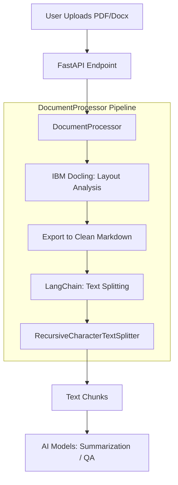

# ⚙️ Document Processor - DocuMind

  🌍 <b><a href="../vi/DOCUMENT_PROCESSOR.md">Vietnamese Version</a></b>

## ⚙️ Document_processor Pipeline

This section details how the `DocumentProcessor` class handles uploaded files through an automated pipeline.

### Pipeline Diagram

---

### Processing Details

#### 1. Ingestion (IBM Docling)
Uploaded files (PDF, Docx) are processed by **Docling**. Unlike simple text extractors, Docling performs layout analysis to:
- Identify and preserve table structures.
- Detect headers and subheaders.
- Filter out noise (page numbers, headers/footers).
- **Result:** A clean, structured Markdown representation.

#### 2. Chunking (LangChain)
The Markdown content is split into smaller, manageable chunks using `RecursiveCharacterTextSplitter`.
- **Chunk Size:** 800-1000 characters.
- **Overlap:** 100 characters (to preserve context between chunks).

#### 3. AI Processing
Each chunk or the combined Markdown is fed into specialized models (ViT5/BARTpho) for summarization and QA.

---

## 🚀 Deployment

DocuMind is designed for both local and server deployment.
- **Local:** Use `uv run python backend/main.py`.
- **Production:** Recommended to use Docker (Dockerfile coming soon).
