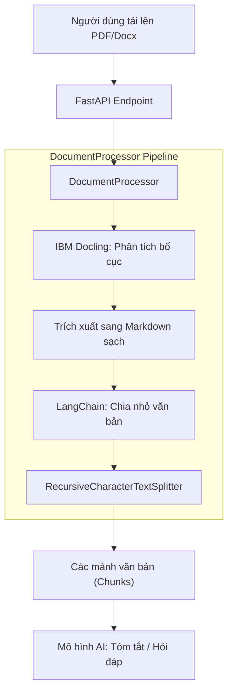

# ⚙️ Quy trình xử lý tài liệu - DocuMind

  🌍 <b><a href="../en/DOCUMENT_PROCESSOR.md">English Version</a></b>

## ⚙️ Document_processor Pipeline

Phần này chi tiết cách lớp `DocumentProcessor` xử lý các tệp đã tải lên thông qua một pipeline tự động.

### Sơ đồ Pipeline

---

### Chi tiết các bước xử lý

#### 1. Tiếp nhận (IBM Docling)
Các tệp được xử lý bởi **Docling**. Không giống như các trình trích xuất văn bản đơn giản, Docling thực hiện phân tích bố cục để:
- Xác định và giữ nguyên cấu trúc bảng.
- Phát hiện tiêu đề và tiêu đề phụ.
- Loại bỏ nhiễu (số trang, đầu trang/chân trang).
- **Kết quả:** Một bản trình bày Markdown có cấu trúc và sạch sẽ.

#### 2. Cắt nhỏ (LangChain)
Nội dung Markdown được chia thành các mảnh nhỏ dễ quản lý bằng `RecursiveCharacterTextSplitter`.
- **Kích thước mảnh:** 800-1000 ký tự.
- **Độ chồng lấp:** 100 ký tự (để bảo toàn ngữ cảnh giữa các mảnh).

#### 3. Xử lý AI
Mỗi mảnh hoặc bản Markdown kết hợp được đưa vào các mô hình chuyên biệt (ViT5/BARTpho) để tóm tắt và hỏi đáp.

---

## 🚀 Triển khai

DocuMind được thiết kế cho cả triển khai cục bộ và máy chủ.
- **Cục bộ:** Sử dụng `uv run python backend/main.py`.
- **Sản xuất:** Khuyến nghị sử dụng Docker (Sẽ sớm có Dockerfile).
